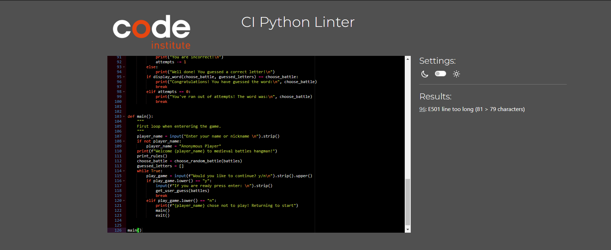

# Medieval Hangman

This is my third milestone project which is a game Medieval Hangman. This game has been designed for those interested in trying a bit of their knowledge around medieval Europe, battles to be specific.
Rules has and tips been added inside the game. 

View Deployed Site Here!(https://medieval-hangman-79561d9b2ff5.herokuapp.com/)

## How to play

Medieval Hangman is fairly simple game, you need to guess a medieval battle, as a hint it is mostly Towns/Citys around Europe as the game is based around European region.
Every correct guess would reveal a letter that has been guessed correctly while others would remain as underscores.
If players attempt count reaches 0 they will be hung and it will be game over.

## Existing features

- Random word generation - Picks out a word to be guessed from a list provided.
- Player can only see underscores and count how many letters could be added.
- Accepts user input.
- Limited amount of attempts per round.
- If same letter guessed twice, game will return with "You have tried this already!"

## Future features

- Add option for different regions around the world for more tests of knowledge.
- Give hints about where the battle took place or who were the commanders.
- In general add more battles as the current sample list is quite small.
- Add option for different centuries.

## Testing

| Test Label                                                             | Test Action                                      | Expected Outcome                                                            | Test outcome |
| ---------------------------------------------------------------------- | ------------------------------------------------ | --------------------------------------------------------------------------- | ------------ |
| Enter name                                                             | Run program                                      | Display message to enter players name.                                      | Pass         |
| Blank name                                                             | Leave name section empty                         | If player leaves name blank it should come up as                            |
|                                                                        |
| Anonymous Player.                                                      | Pass                                             |
| Display welcome message                                                | Enter name or leave it blank and                 |
|                                                                        |
| press enter                                                            | After user enter their name/leaves it blank they |
|                                                                        |
| should receive a welcome message and display                           |
|                                                                        |
| of rules hangman and some tips.                                        | Pass                                             |
| Continue                                                               | Press y / n and enter                            | After pressing y user should be able to proceed.                            |
|                                                                        |
| If they have entered N they will brought back to beginning.            | Pass                                             |
| Ready to start                                                         | Press enter                                      | Press enter to start the game.                                              | Pass         |
| Display word                                                           | Entering the game                                | After entering the game user should be displayed a word with                |
|                                                                        |
| "_" on every letter that has not been guessed yet.                     | Pass                                             |
| Correct guess                                                          | Enter correct letter                             | If user enters correct letter the "_" turns into correctly guessed          |
|                                                                        |
| letters and receive message " Well done! You have guessed a            |
|                                                                        |
| correct letter!" the remaining attempts will stay the same.            | Pass                                             |
| Incorrect guess                                                        | Wrong letter                                     | When user enters incorrect letter or number they will receive message       |
|                                                                        |
| "You are incorrect!" their remaining attempts will go down by 1.       | Pass                                             |
| Invalid guess                                                          | Enter number/blank space                         | Whenever user tries to enter a number or tries to enter nothing they will   |
|                                                                        |
| receive the following message "Please enter a letter". Their remaining |
|                                                                        |
| attempts will remain the same.                                         | Pass                                             |
| Winning                                                                | Guess the word correctly                         | If user guesses all the letters correctly they will have message display of |
|                                                                        |
| "Congratulations! You have guessed the word:(The word guessed) "       | Pass                                             |
| Loosing                                                                | Guess the word incorrectly                       | If user runs out of attempts they will be shown a message: "You've run out  |
|                                                                        |
| of attempts! Your word was: "                                          | Pass                                             |

I have manualy tested this porject by:
- Passed code through PEP8 linter and found no issues

- Entering same letters provides with you have tried this letter before.
- I have tried the game inside the Gitpod.io terminal as well as Heroku app terminal.

## Bugs remaining

- Currently there are no known bugs.

## Bugs solved

- I had issues with letters that have been guessed not prining out afer being typed in. In order to solve this I shifted print statements around which seems to done the trick.

- Some words were being displayed altogether due to missing commas after battle names.

## Deployment

# Github forking

- Go to github repository
- At the top of the page you will find  a "Fork Button" press it.
- In the next page you will find green button in middle of your page, again click create.

# Heroku Deployment

- Log into Heroku.
- Inside the app click on dashboard, then click on "Create new App".
- Enter Unique name for you application otherwise it might get rejected, select region which suits you.
- Click on create app.
- At the application configuration page, apply settings as follow Deploy section: aplication. In the reveal Config VARS enter "CREDS" for the Key you want to paste your contents from your CREDS.json file. Note that this step is neccesary if you have added external APIs.
- Click on add.
- Add another config Var  with key PORT and value of "8000"
- Inside  Settings go down to the Buildpack  while clicking on Add Build Pack.
- Make sure to add python as first and then nodejs in order to run server properly.
- Go to the Deploy Section and select  to deploy "Automatically"(Note this is not necessary but saves time, as your app will automatically refresh with every git push)
- Click on deploy wait for deploy ment website should be will be displayed there.

## Aplications Used

Gitpod.io IDe for developing the website.
Github.com was used for keeping version control and posting my readme.
Heroku.com was used  for hosting website.
Code institute template for begining of work.
W3C schools for refreshing memories on code.
